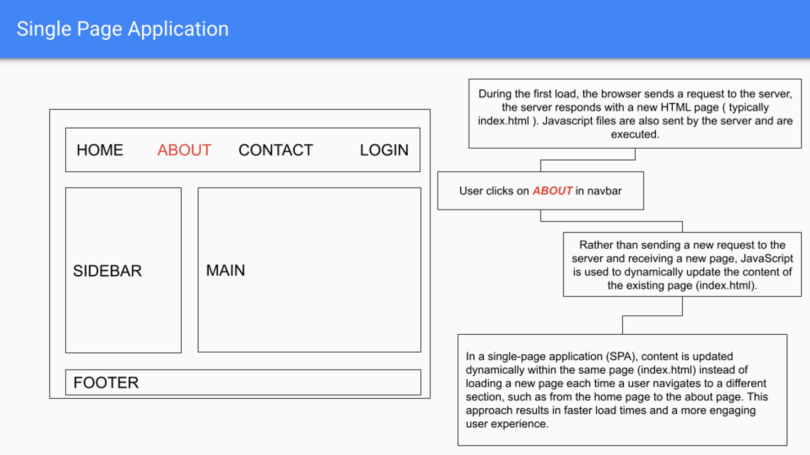

># Introduction to react

># Importance of Persistence in Coding and Learning

## Key Advice:
**"Do not stop coding despite potential failures or difficulties."**

### What Does This Mean?
Persistence in coding means consistently putting in effort to learn and solve problems, even when faced with challenges. It is about understanding that difficulties and setbacks are a natural part of the learning process and are essential for growth.

### Why Is Persistence Important?
1. **Continuous Effort:** Consistent practice helps you become more proficient over time.
2. **Learning Through Challenges:** Encountering and overcoming problems enhances your understanding and skills.
3. **Resilience:** Developing resilience allows you to face and conquer obstacles, making you a stronger coder.

### Detailed Explanation:
Persistence is crucial for anyone learning to code or improving their coding skills. Here's why:

- **Learning Curve:** Initially, coding can be tough, with many new concepts to grasp. Persistence helps you push through this challenging phase.
- **Problem-Solving Skills:** Each problem you solve improves your ability to tackle future issues.
- **Confidence Building:** Successfully overcoming difficulties boosts your confidence, preparing you for more complex tasks.
- **Experience:** Failures and difficulties provide valuable experience, teaching you effective strategies and approaches.
- **Continuous Improvement:** By not giving up, you steadily enhance your coding abilities, becoming better over time.

### Real-Life Example:
Imagine you're building a new feature for your project, and you encounter a bug that seems impossible to fix. Instead of giving up, you persist by trying different solutions, researching, and seeking help from others. Eventually, you find the solution. This process not only resolves the bug but also teaches you new techniques and builds your confidence for future challenges.

### Conclusion:
Persistence is key to becoming a successful coder. Every setback is an opportunity to learn and grow. Don't be discouraged by difficulties; keep coding, keep learning, and you will see continuous improvement over time.

Remember, challenges are just stepping stones on your path to mastery. Stay persistent, and you'll achieve your coding goals!

---

># React Basics

- Intro to react
- Framework vs Library
- Why react?

# **React Intro** :

https://react.dev/learn

# Introduction to React

React is a powerful JavaScript library developed by Facebook, designed specifically for building dynamic and interactive user interfaces (UIs) for web applications. It has gained immense popularity among developers due to its efficiency, flexibility, and the ability to create reusable UI components.

## Key Features of React

### Virtual DOM
- **Efficient Updates**: React uses a virtual DOM to optimize updates. When the state of a component changes, React updates the virtual DOM first, then efficiently determines the minimal set of changes needed to update the real DOM, resulting in better performance.

### Component-Based Architecture
- **Reusable Components**: React allows you to build encapsulated components that manage their own state, and then compose them to create complex UIs. This promotes reusability and makes your code more maintainable.
- **Modular**: Each component in React can be thought of as a module with a distinct purpose, which makes your code easier to understand and debug.

### Unidirectional Data Flow
- **Predictable State Management**: React enforces a one-way data flow, which means that data flows in a single direction through your application. This makes it easier to track how data changes in your app and to debug issues.

### JSX – JavaScript Syntax Extension
- **HTML in JavaScript**: JSX allows you to write HTML-like syntax directly within your JavaScript code. This makes your code more readable and easier to write, as you can see the structure of your UI directly in the code.

### Ecosystem and Community
- **Rich Ecosystem**: React has a vast ecosystem of libraries and tools that can help you with everything from state management (like Redux) to routing (like React Router) and more.
- **Active Community**: With a large and active community, you’ll find plenty of resources, tutorials, and support to help you learn and solve problems.

## Why Use React?

- **Speed and Efficiency**: The virtual DOM and efficient updating mechanism make React very fast.
- **Flexibility**: React’s component-based architecture and unidirectional data flow give you the flexibility to design your application’s architecture as you see fit.
- **Developer Experience**: Tools like Create React App, React DevTools, and the extensive community support make developing with React a pleasant experience.

## Conclusion

React is an excellent choice for building modern, interactive web applications. Its component-based architecture, efficient rendering

# **Framework and Library**

In the coding world, libraries and frameworks are your toolkit and blueprint, respectively.

## **Library**:

- It's a collection of ready-to-use code snippets that you can call upon.
- **Example**: Imagine a library as a toolbox. You pick the tools you need, when you need them.

## **Framework**:

- It's a structured template that tells you how to build your application.
- **Example**: It’s like a recipe. You follow the steps and add your ingredients to cook up an app.

In a nutshell, a library gives you tools, while a framework gives you a structured plan. The use case is basically the same: both help developers build web applications faster and better.

## **Library**:

A library is a collection of reusable code that provides specific functionality. You can think of it as a set of tools that you can choose to use in your project. You are in control of when and how you use these tools. Libraries help you avoid rewriting common functionality and save time.

## **Framework**:

A framework, on the other hand, provides a structure and a set of rules for building applications. You can think of it as a blueprint that guides you on how to build your project. When using a framework, you need to follow its conventions and design patterns, and it often dictates the application's structure. In essence, a framework provides a foundation, and you fill in the specific details of your application.

To summarize, a library is like a set of tools you can use in your project as needed, while a framework is a blueprint that provides a structure and rules for your project.

## **Need more understanding? Okay, how about this?**

### **Library**:

Let's say you want to build a house. A library would be like buying pre-made building materials like bricks, lumber, nails, and roofing shingles that you can use to build your house. You have control over how you use those materials, and you can use them to build the house you want, but you have to do all the work yourself.

### **Framework**:

If you happened to order some furniture on an e-commerce website, like a DIY cupboard kit, it comes with all the necessary parts. There will be a manual which contains all the instructions on how to assemble it. You have less control over how the cupboard looks and functions, but it's easier and faster to assemble since you're following a pre-set structure and guidelines.

Frameworks provide a general structure (a particular way of writing code) and you, as a developer, have to follow that exact same structure. A library, on the other hand, provides you with some tools (code to work with) and does not enforce you to follow any structure.

Both make the development process faster and better.

This explanation should help clarify the differences between libraries and frameworks, and how they both play crucial roles in the development process.

---

# **Why is React so popular** :

**Ease of Development**:

React lets you create reusable components, making development quicker and collaborative fun. Check the comparison in file to see how React simplifies code compared to Vanilla JavaScript:

As you can see, using React allows you to write cleaner and more readable code. It abstracts away many of the repetitive tasks, letting you focus on building your application.

># **Single Page Application (SPA)?**

# Traditional Multi Page Application

# Traditional Multi-Page Application (MPA)

## Overview
The diagram illustrates how a Traditional Multi-Page Application (MPA) functions:

### Initial Page Load
- When a user first loads a website, the browser sends a request to the server.
- The server responds by sending back a new HTML page (typically `index.html`).
- The server also sends necessary JavaScript files to the browser, which then executes them.

### User Navigation
- When a user clicks on a link in the navigation bar (e.g., "ABOUT"), the browser sends a request to the server for the new page.

### Server Response
- The server sends a completely new HTML page (e.g., `about.html`) back to the browser.
- Any necessary JavaScript files must be reloaded and executed again to ensure the new page functions correctly.

### Performance Impact
- This process of loading new HTML pages and reloading JavaScript files for each navigation can cause delays.
- It results in a less responsive user experience compared to other approaches (like Single Page Applications).

## Key Points
- Traditional MPAs reload the entire page from the server with each user action.
- This leads to longer load times and a less seamless experience.
- The diagram illustrates the steps and highlights the performance drawbacks of this approach.
- Understanding this concept is crucial for web development, as it contrasts with more modern techniques like Single Page Applications (SPAs), which aim to enhance user experience by loading content dynamically without full page reloads.

# Single Page Application

## Overview

A Single Page Application (SPA) is a type of web application that dynamically updates the current page rather than loading entire new pages from the server. This approach results in faster interactions and a more fluid user experience.

## How SPAs Work

### Initial Page Load
1. **Request and Response:**
   - When a user first loads the SPA, the browser sends a request to the server.
   - The server responds with a single HTML page (typically `index.html`).
   
2. **JavaScript Execution:**
   - Along with the HTML, the server sends JavaScript files, which are loaded and executed by the browser. These typically include frameworks or libraries like React, Angular, or Vue.js.

### Client-Side Routing
1. **Navigation:**
   - When a user clicks on a link (e.g., "ABOUT"), JavaScript intercepts this action instead of sending a new request to the server.

2. **Dynamic Content Update:**
   - JavaScript dynamically updates the content of the existing page by manipulating the DOM, avoiding a full page refresh.

### Efficient Data Handling
1. **AJAX Requests:**
   - SPAs often use AJAX to fetch new data from the server as needed.
   
2. **Partial Updates:**
   - Only the necessary parts of the page are updated, reducing data transfer and speeding up interactions.

## Benefits of SPAs

1. **Performance:**
   - Faster load times after the initial load because only data, not entire pages, is transferred.

2. **User Experience:**
   - Provides a more app-like experience with smoother transitions and interactions.

3. **Development:**
   - Simplified development and maintenance with a centralized state management.

## Potential Drawbacks

1. **Initial Load Time:**
   - The initial load can be slower due to downloading and executing all necessary JavaScript.

2. **SEO Challenges:**
   - Traditional SEO can be more challenging since content is loaded dynamically.

3. **Browser Compatibility:**
   - Requires modern browsers with good JavaScript support.

# **Performance:**
   
# React Performance: Understanding Batch Updates and Virtual DOM

This document explains why React is known for its fast performance by diving into two key concepts: Batch Updates and Virtual DOM.

## 1. Batch Updates

### a. Traditional DOM Updates
- **Problem:**
  - Each change to the DOM triggers a full UI re-render.
  - This approach is slow and inefficient, akin to making a separate trip for each item on your shopping list.
  - Even the fastest systems will get dead tired by the end!

### b. Batch Updates in React
- **Solution:**
  - React groups multiple updates together and applies them at once.
  - This approach is like jotting down all the items you need and making one trip to the store.

- **Advantages:**
  - Reduces the number of re-renders.
  - Improves efficiency and speed.

## 2. Virtual DOM

### a. What is the Virtual DOM?
- **Definition:**
  - A lightweight copy of the actual DOM.
  - React uses this to track changes efficiently.

### b. How Virtual DOM Works
- **Update Process:**
  - Changes are first made to the Virtual DOM.
  - React compares the Virtual DOM with the real DOM (diffing).
  - Only the parts that changed are updated in the real DOM (reconciliation).
 
### c. Advantages of Virtual DOM
- **Efficiency:**
  - Updates only the necessary parts of the DOM.
  - Reduces the number of direct manipulations to the real DOM.
  - Results in faster and smoother updates.
0
## 3. Analogy for Better Understanding

### a. Renovating a Room

- **Traditional Approach (Vanilla JS & DOM):**
  - Break down the whole house to renovate a room.
  - This is like destroying the entire DOM tree and rebuilding it with changes.

- **React's Approach:**
  - Use two blueprints: a Master copy and a Working copy.
  - Mark changes on the Working copy.
  - Compare with the Master copy to see what changes are needed.
  - Apply changes to just that room.
  - The Working copy becomes the new Master copy.

## 4. In a Nutshell

- **Batch Updates:**
  - React groups multiple updates and applies them together, improving performance.
- **Virtual DOM:**
  - React uses a virtual copy of the DOM to track changes and update only the necessary parts, making updates faster and smoother.

## Key Takeaways

- **React is faster because of Batch Updates and Virtual DOM.**

- **As a developer:** You don't need to manage these processes directly; React handles them behind the scenes, allowing you to focus on building your application.

---