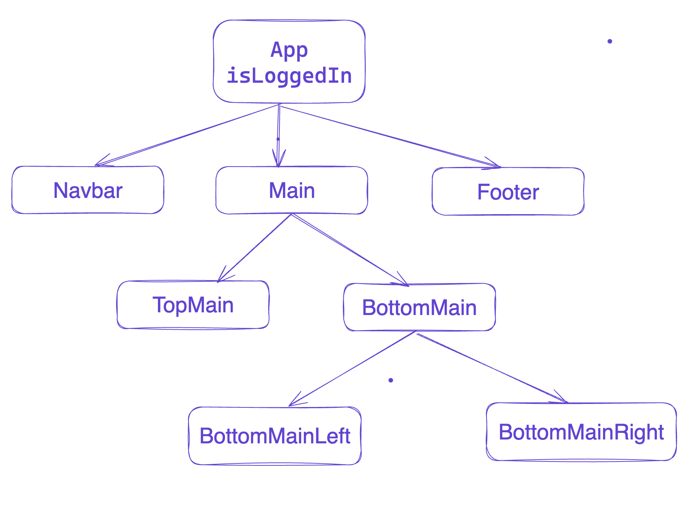
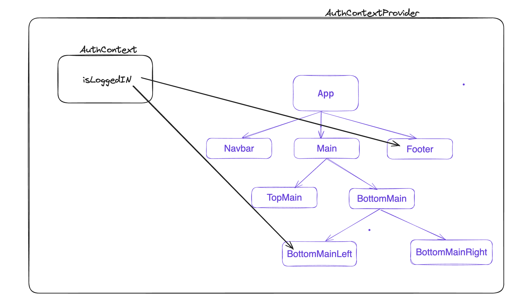

># Prop Drilling in React

Prop drilling, often referred to as "prop threading" or "prop tunneling," occurs when data is passed through multiple layers of a component tree in a React application, just to reach a deeply nested component. This practice can lead to several issues, such as:

>## Issues with Prop Drilling

1. **Unnecessary Data Passing**: 
   - You end up passing data through components that don't need it, which makes the code harder to read and maintain.

2. **Frequent Re-renders**: 
   - Changes to props can trigger re-renders in intermediate components that only pass the data along, not actually using it. This can impact the performance of the application.

3. **Increased Complexity**: 
   - Managing and understanding the flow of props becomes more complex, leading to a higher likelihood of bugs and difficulties in refactoring.


Let's say you have an app where you're tracking whether a user is logged in or not. You might store that data in the state of your top-level `<App />` component like so : 

Imagine your component tree look something like this.  If the component say `BottomMainRight` requires this `isLoggedIn`, it has to pass through components. There are chances that some of these component in between doesn’t even require this value `isLoggedIn` but you are still passing so that it can be further passed down to `BottomMainRight`




### 1. Props Drilling

- **Concept**: Props drilling is the practice of passing data from a parent component through various levels of nested child components.
- **Problem**: This method becomes cumbersome and inefficient as the component tree grows deeper, leading to reduced reusability and the risk of missing props.


># Now the solution is *Context API*

- **Solution**: The Context API is React's answer to the props drilling problem.

three formulas 
 { CWC }
# create 
# Wrap
# consume


# Context API :

Context API basically provides a way to pass data through the component tree without having to pass props down manually at every level.

Let’s learn how to setup and use Context API by building a simple application which manages login state.  We'll create a context to manage the `isLoggedIn` state and use it across various components without props drilling.

Setup is pretty simple and straight forward and you can remember by 
***CPC ( Create - Provide - Consume ) .***


>### Step 1: Create Context

- **Purpose**: Create a React Context to hold global data.
- **Implementation**:

```javascript
export const AuthContext = React.createContext();
```

>### Step 2: Provide

- **Purpose**: Make the context available to components.
- **Implementation**:

>### Step 3: Consume

- **Purpose**: Utilize the context data in components.
- **Implementation**:

```javascript
function BottomMainLeft() {
  const { isLoggedIn } = React.useContext(AuthContext);
  // Component code
}
```

