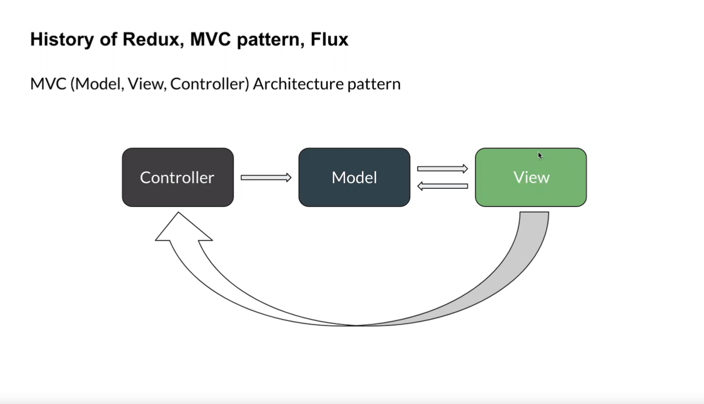
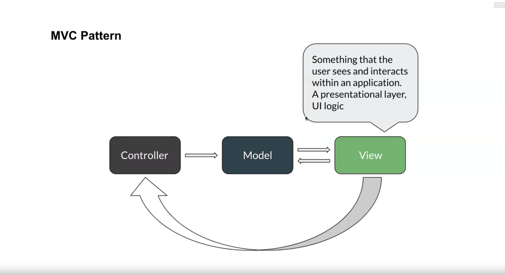
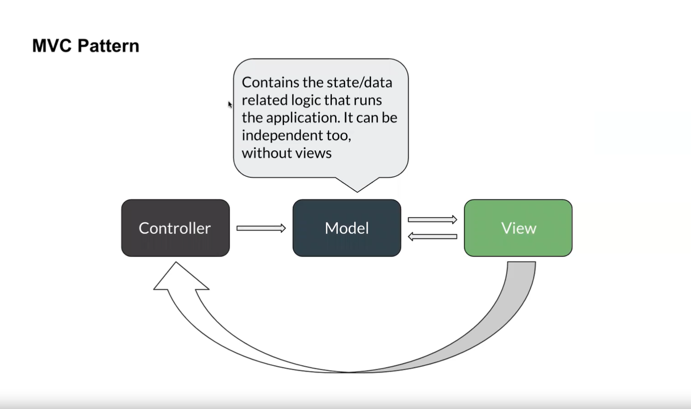
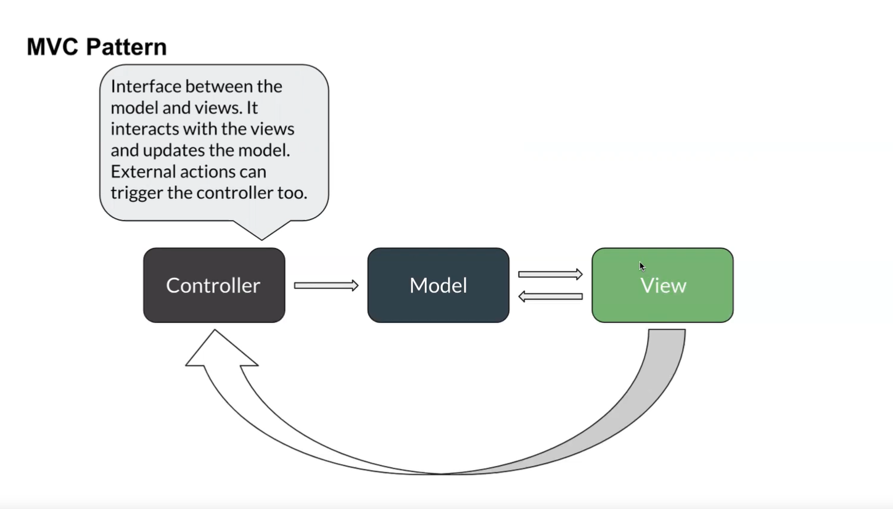
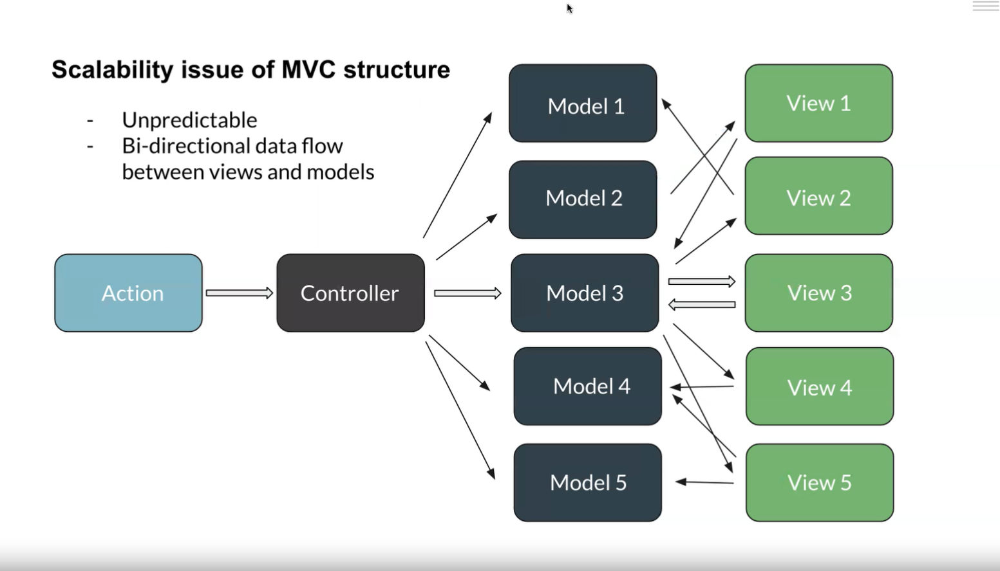
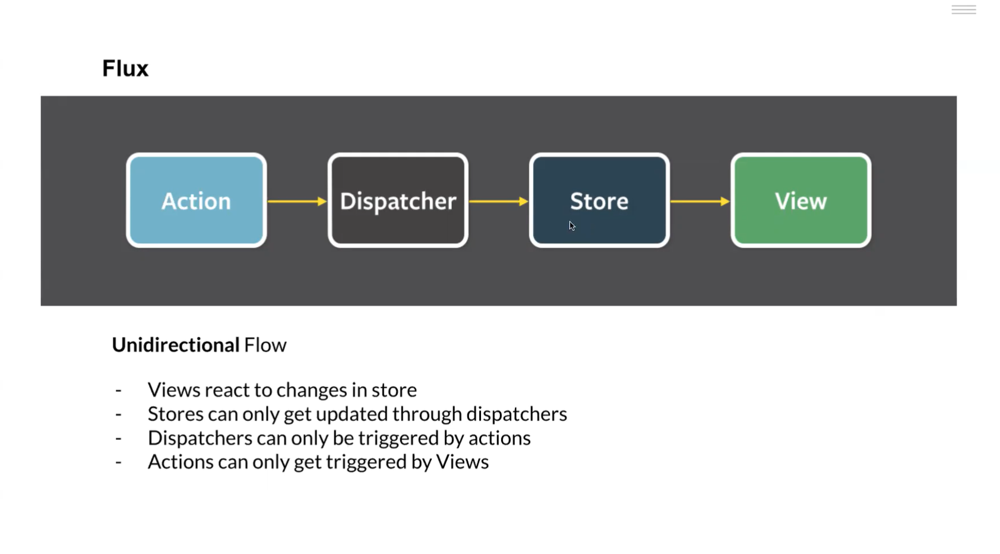

># -------------------- Redux -------------------

># 1. Why redux come into a Picture and History of Redux, MVC pattern, Flux




```
View : Something that the user sees and interacts within an application.
A presentational layer, Ul logic
```




```
Controller : Contains the state/data related logic that runs the application. 
It can be independent too, without views
```



```
- Interface between the model and views. 
- It interacts with the views and updates the model.
- External actions can trigger the controller too.
```


># Scalability issue of MVC structure



># Flex

